<div align="center">

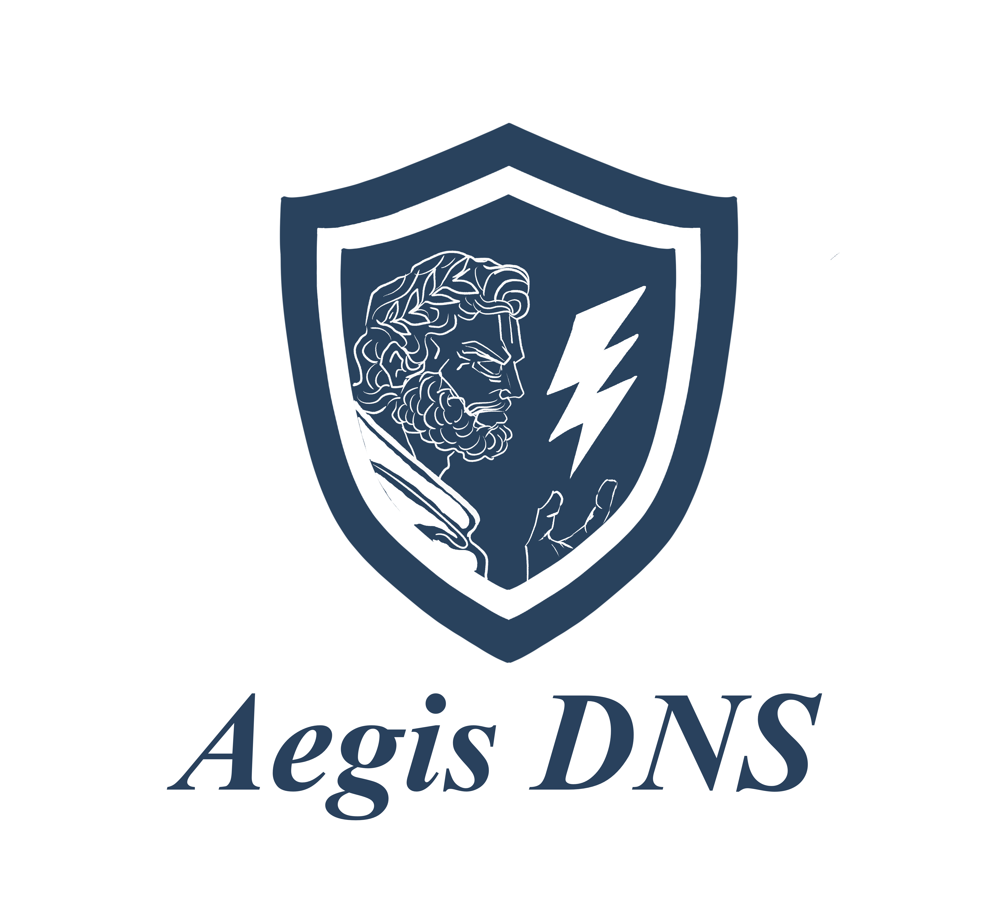

# AegisDNS

**DNS-level connection interception, analysis, and maliciousness scoring.**


</div>

---

AegisDNS is a security monitoring tool which consists of a browser extension, a desktop application, and a local Flask server that bridges the two. This system is combined to provide many functionalities, such as unlimited address scans with a heuristic engine, blacklisting/whitelisting, AI overviews to explain scan results in plain language, background browser activity monitoring, and more.


---

## Screenshots

<table>
  <tr>
    <td align="center"><b>Login</b></td>
    <td align="center"><b>Create Account</b></td>
  </tr>
  <tr>
    <td>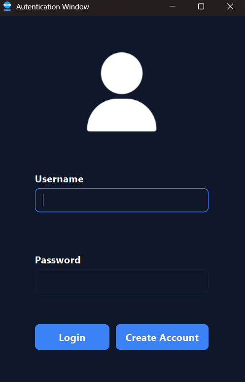</td>
    <td>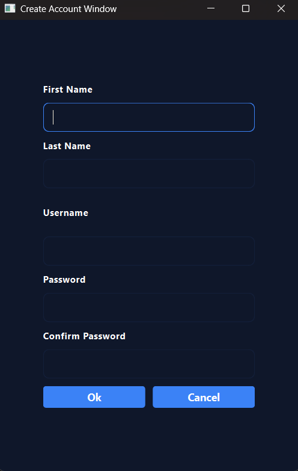</td>
  </tr>
  <tr>
    <td colspan="2" align="center"><b>Scanner Results</b></td>
  </tr>
  <tr>
    <td colspan="2" align="center">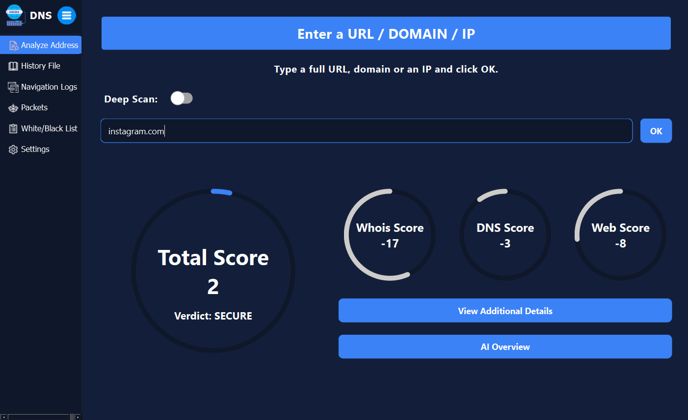</td>
  </tr>
  <tr>
    <td align="center"><b>Additional Scan Details</b></td>
    <td align="center"><b>AI Overview</b></td>
  </tr>
  <tr>
    <td>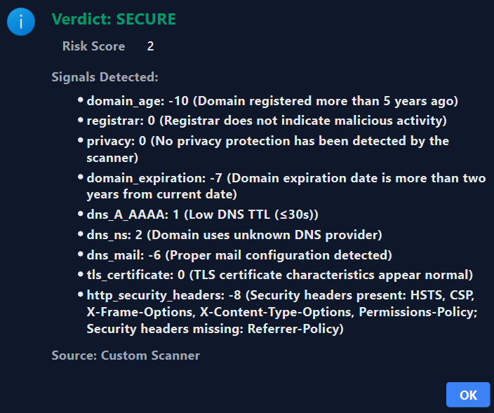</td>
    <td>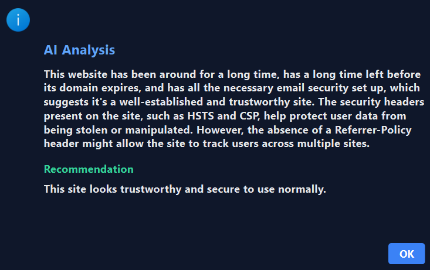</td>
  </tr>
  <tr>
    <td colspan="2" align="center"><b>Blacklist Window</b></td>
  </tr>
  <tr>
    <td colspan="2" align="center">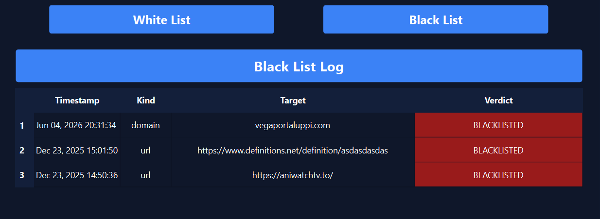</td>
  </tr>
  <tr>
    <td align="center"><b>Navigation Logs</b></td>
    <td align="center"><b>Scan History</b></td>
  </tr>
  <tr>
    <td>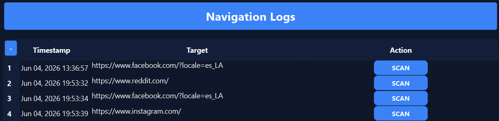</td>
    <td>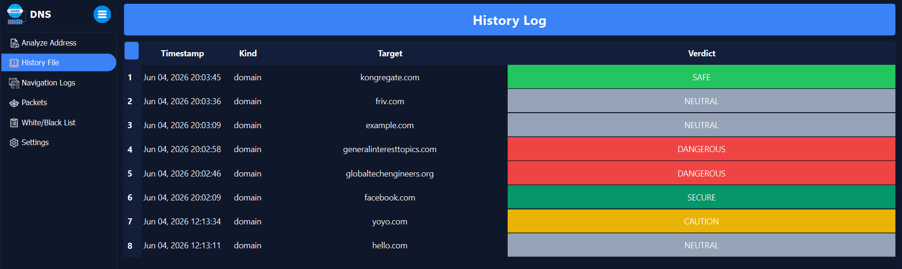</td>
  </tr>
  <tr>
    <td align="center"><b>Packet Sniffer</b></td>
    <td align="center"><b>Protocol Animation</b></td>
  </tr>
  <tr>
    <td>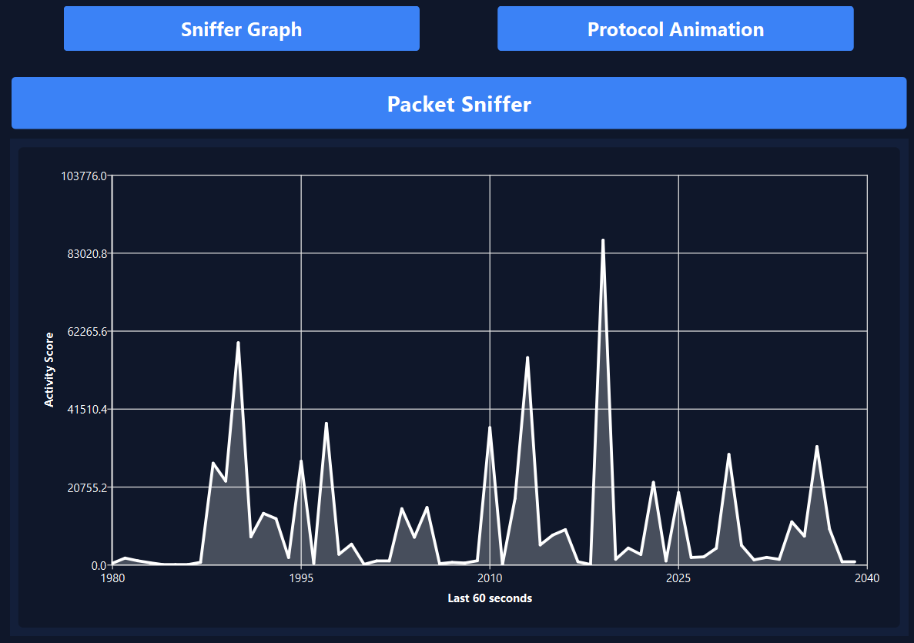</td>
    <td>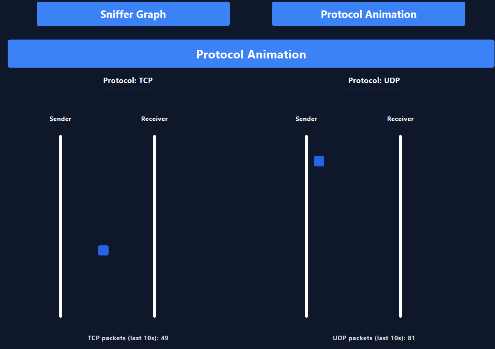</td>
  </tr>
  <tr>
    <td align="center"><b>Browser Extension</b></td>
    <td align="center"><b>Safe Mode Interstitial</b></td>
  </tr>
  <tr>
    <td>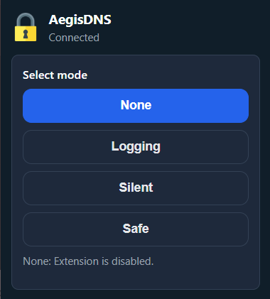</td>
    <td>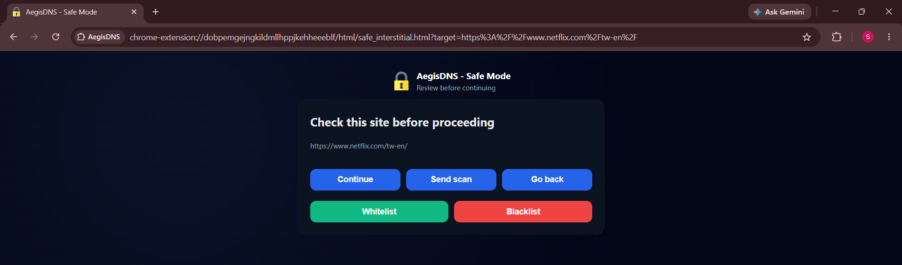</td>
  </tr>
  <tr>
    <td align="center"><b>Blacklist Interstitial</b></td>
    <td align="center"><b>Silent Mode Notification</b></td>
  </tr>
  <tr>
    <td>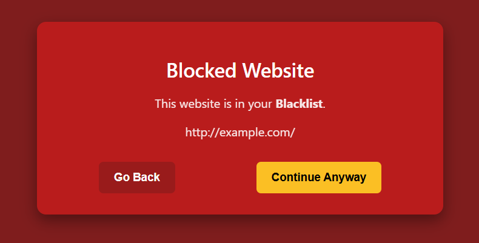</td>
    <td>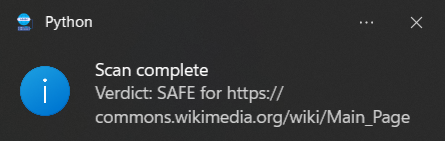</td>
  </tr>
</table>

### Themes

<table>
  <tr>
    <td align="center">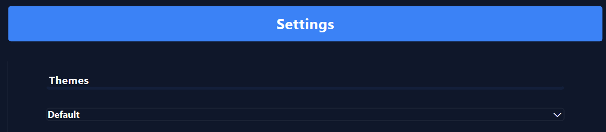<br/><b>Default</b></td>
    <td align="center">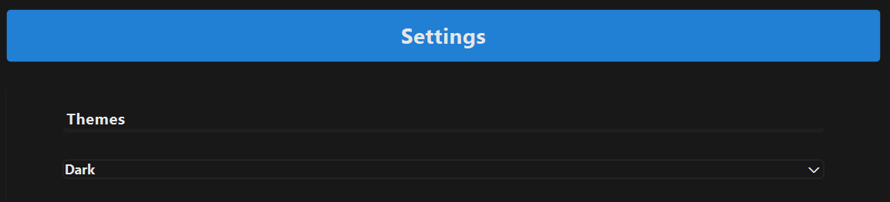<br/><b>Dark</b></td>
    <td align="center">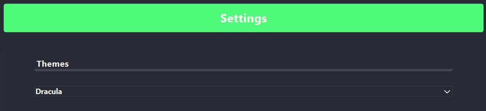<br/><b>Dracula</b></td>
    <td align="center">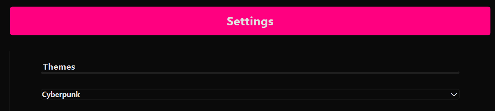<br/><b>Cyberpunk</b></td>
  </tr>
</table>

---

## Architecture

<div align="center">
  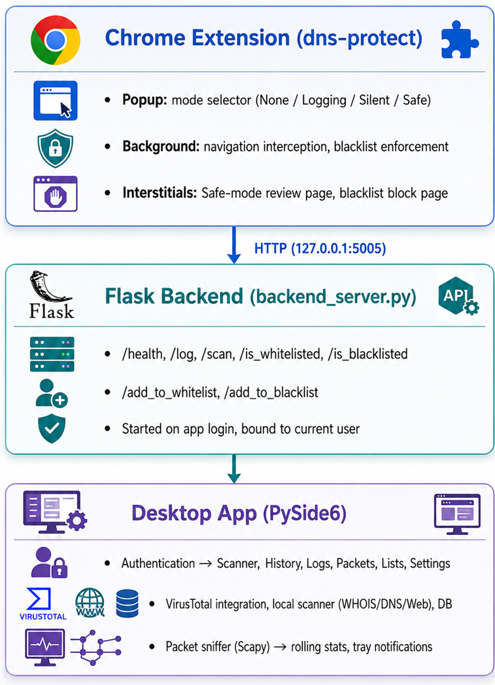
</div>

---

## Features

### Desktop Application

#### Authentication
- Login and account creation with bcrypt password hashing
- SQLite database via SQLAlchemy for users and scan history
- Flask backend starts automatically on login and binds to the current user

#### Scanner
- Accepts URLs, domains, or raw IP addresses
- **Custom Scan** — local heuristic scoring engine (WHOIS, DNS, Web/TLS, IP rules)
- **Deep Scan** — VirusTotal API combined with the local scanner
- **AI Overview** — locally-run Llama 3.2 3B explains results in plain language
- Results include total risk score, per-category signals, and a verdict (SECURE → MALICIOUS)
- Scan history saved to JSONL and database; system tray notification on completion

#### Navigation Logs
- Table of navigations recorded by the extension (timestamp, target, mode)
- Populated by Logging, Silent, and Safe modes
- Live refresh every 3 seconds

#### Scan History
- Table of past scans (timestamp, kind, target, verdict)
- Context menu: add to whitelist or blacklist, delete entry

#### Packet Monitor
Two views:
- **Sniffer Graph** — rolling chart of bytes in/out over the last 60 seconds
- **Protocol Animation** — TCP vs UDP packet counts with animated indicators

Packet capture runs in the background via Scapy; data is aggregated per second in a rolling window. Tray notifications trigger on high packet rates or DNS anomalies.

#### White / Black List
- Per-user lists used by the extension at runtime
- Whitelist: domains allowed through without review in Safe mode
- Blacklist: domains always blocked with a red interstitial

#### Settings
- Themes: Default, Dark, Dracula, Cyberpunk
- Mute system tray notifications
- Reset scan history / navigation history
- User account management: change username, change password, delete account

---

### Browser Extension

Connects to the local Flask backend. Requires the desktop app to be running and the user logged in.

#### Modes

| Mode | Behaviour |
|------|-----------|
| **None** | Extension disabled — no logging or blocking |
| **Logging** | Logs each navigation to the app silently |
| **Silent** | Logs navigations and triggers background scans automatically |
| **Safe** | Intercepts every navigation; user reviews before the page loads |

#### Safe Mode Flow
1. User navigates to any URL
2. Extension redirects to a review interstitial
3. User can **Continue**, **Send scan**, **Go back**, **Whitelist**, or **Blacklist**

#### Blacklist Enforcement
Blacklisted URLs are blocked with a red interstitial in all active modes. The user can go back or bypass once.

---

### Scanner / Scoring Engine

The `scanner/` package evaluates domains and URLs across four signal categories:

| Category | Signals |
|----------|---------|
| **WHOIS** | Domain age, registrar reputation, privacy protection, expiration date |
| **DNS** | A/AAAA records, TTL, nameserver provider, MX/SPF/DMARC configuration |
| **Web** | TLS certificate validity, issuer, HTTP security headers |
| **IP** | IP-based risk indicators (when input is a raw IP address) |

Risk scores (0–100) map to verdicts:

| Score | Verdict |
|-------|---------|
| 0–10 | SECURE |
| 11–20 | SAFE |
| 21–30 | NEUTRAL |
| 31–40 | CAUTION |
| 41–50 | SUSPICIOUS |
| 51–59 | DANGEROUS |
| 60+ | MALICIOUS |

---

## Repository Structure

```
Capstone/
├── src/
│   ├── main.py                 # App entry point
│   ├── gui/                    # All windows and widgets
│   │   ├── Autentication_Window.py
│   │   ├── sidebar.py          # Main layout, sniffer wiring, notifications
│   │   ├── Scanner_Window.py
│   │   ├── history_window.py
│   │   ├── log_window.py
│   │   ├── WhiteBlackList_Window.py
│   │   ├── SnifferContainer_Window.py
│   │   ├── settings_window.py
│   │   └── ...
│   ├── logic/
│   │   ├── vt_service.py       # VirusTotal API, cache, history
│   │   ├── scanner_service.py  # Local scanner thread, cache
│   │   ├── llm_service.py      # Llama 3.2 inference, prompt construction
│   │   └── backend_server.py   # Flask REST API for extension
│   ├── SQL_Alchemy/            # User and address tables (SQLAlchemy)
│   └── VT_Cache/               # JSONL logs, caches, settings
├── scanner/                    # Heuristic scoring engine
│   ├── scanner.py
│   ├── features/               # whois, dns, web, ip
│   └── scoring/                # rules_whois, rules_dns, rules_web, rules_ip
├── sniffer_test/
│   ├── packet_sniffer.py       # Scapy capture and metadata extraction
│   ├── aggregator.py           # Rolling per-second buckets
│   └── sniffer_worker.py       # Emits snapshots to the UI
└── dns-protect/                # Chrome browser extension
    ├── manifest.json
    ├── html/                   # popup, safe_interstitial, blacklist_interstitial
    ├── scripts_/               # background, popup, interstitials
    └── styles/
```

---

## Requirements

- Python 3.10+
- Chrome or Chromium
- VirusTotal API key (for Deep Scan)
- Admin / elevated permissions for packet capture (Scapy)

---

## Setup

### 1. Clone and install

```bash
git clone https://github.com/Zeviant/Capstone.git
cd Capstone
python -m venv .venv
```

```powershell
# Windows
.\.venv\Scripts\Activate.ps1
```

```bash
# Linux / macOS
source .venv/bin/activate
```

```bash
pip install PySide6 scapy requests python-dotenv sqlalchemy tldextract dnspython python-whois flask flask-cors llama-cpp-python
```

### 2. VirusTotal API key

Deep Scan requires a free VirusTotal API key. Register at [virustotal.com](https://www.virustotal.com) → sign in → go to your profile → **API Key**. The free tier is sufficient.

Create a `.env` file in the project root:

```
VIRUSTOTAL_API_KEY=your_api_key_here
```

### 3. Load the browser extension

1. Open Chrome and navigate to `chrome://extensions`
2. Enable **Developer mode** (top right)
3. Click **Load unpacked**
4. Select the `dns-protect/` folder

### 4. Run

```bash
python -m src.main
```

- Log in or create an account
- The Flask backend starts automatically
- The extension will show **Connected** once it reaches the backend
- The packet sniffer starts in the background

---

## AI Model

AegisDNS includes a locally-hosted AI assistant that translates scan results into plain-language explanations. The model (Llama 3.2 3B Instruct, Q4\_K\_M) is downloaded automatically from Hugging Face on first use (~2 GB). All inference runs entirely on your machine — no data is sent externally.

---

## Disclaimer

This project is intended for defensive security monitoring and educational purposes. 
